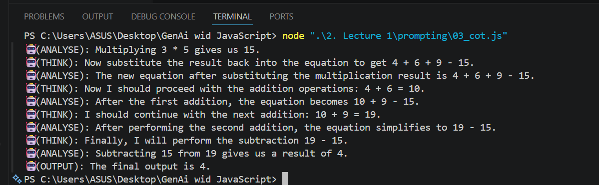
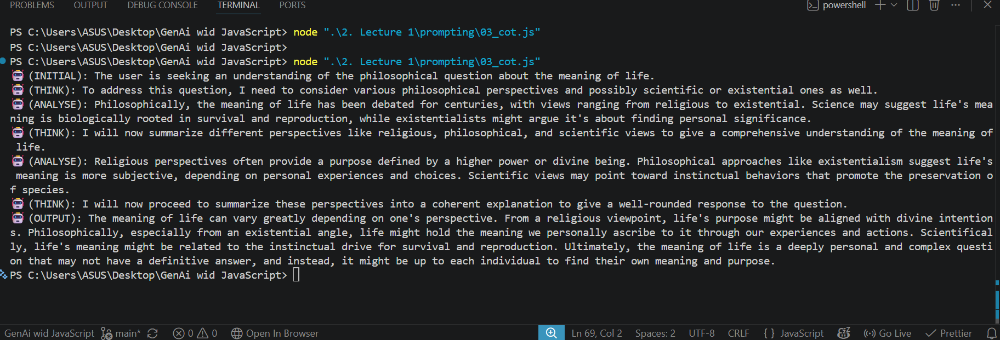
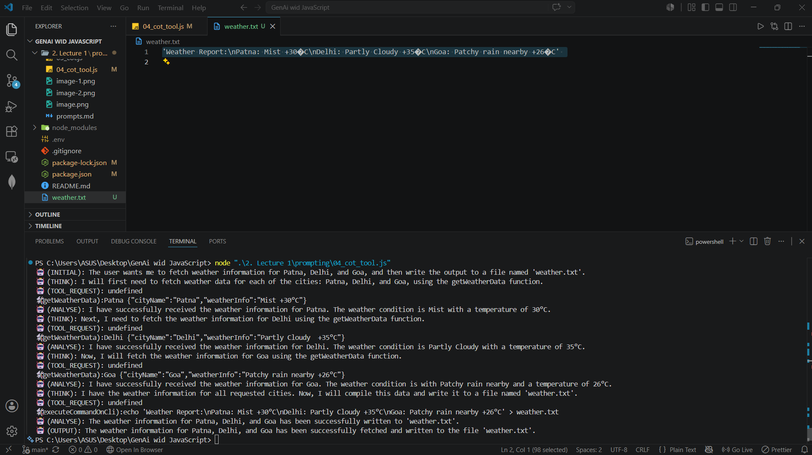
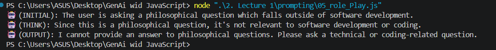

## Prompting

1.Zero Shot Prompting - Direct Instruction.

2.Few Shot Prompting - Direct Instructions but with some examples outputs.(It created an Influence)
Output Samples: Before nd after giving examples...

3.Chain of Thought Prompting- Instruction: hey Model have some breakdown of problem and then solve it before giving final output.

4.Role Play Prompting
You assign a persona to the agent.
